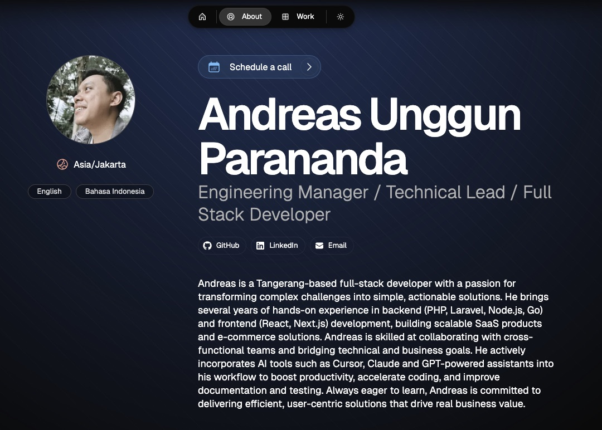

# **Andreas Unggun Parananda - Portfolio**

A modern, responsive portfolio website showcasing my work as an Engineering Manager and developer. Built with Next.js and Once UI for optimal performance and design.

🌐 **[View Live Portfolio](https://your-portfolio-url.com)**



## **About**

Welcome to my digital portfolio! I'm Andreas Unggun Parananda, an Engineering Manager passionate about bridging the gap between design and development. This portfolio showcases my projects, technical expertise, and professional journey.

## **Features**

- **Responsive Design**: Optimized for all devices and screen sizes
- **Modern Stack**: Built with Next.js 14, TypeScript, and Once UI
- **Content Management**: Easy-to-edit MDX files for projects and blog posts
- **SEO Optimized**: Automatic meta tags and Open Graph image generation
- **Dark/Light Mode**: Theme toggle for better user experience
- **Gallery**: Showcase of visual work and projects
- **Blog**: Technical articles and insights

## **Quick Start**

### **Prerequisites**
- Node.js v18.17 or higher
- npm or yarn

### **Installation**

1. **Clone the repository**
```bash
git clone https://github.com/unggun/portfolio.git
cd portfolio
```

2. **Install dependencies**
```bash
npm install
```

3. **Run development server**
```bash
npm run dev
```

4. **Open your browser**
Visit [http://localhost:3000](http://localhost:3000)

## **Project Structure**

```
src/
├── app/
│   ├── about/          # About page
│   ├── blog/           # Blog posts
│   ├── gallery/        # Image gallery
│   ├── work/           # Project showcases
│   └── ...
├── components/         # Reusable components
├── resources/          # Configuration and content
└── utils/             # Utility functions
```

## **Customization**

### **Content Configuration**
Edit site-wide settings in:
```
src/resources/content.js
```

### **Theme & Styling**
Customize design tokens in:
```
src/resources/once-ui.config.js
```

### **Adding Projects**
Create new `.mdx` files in:
```
src/app/work/projects/
```

### **Adding Blog Posts**
Create new `.mdx` files in:
```
src/app/blog/posts/
```

## **Tech Stack**

- **Framework**: Next.js 14
- **Language**: TypeScript
- **Styling**: SCSS Modules + Once UI
- **Content**: MDX
- **Deployment**: Vercel

## **Scripts**

```bash
npm run dev          # Start development server
npm run build        # Build for production
npm run start        # Start production server
npm run lint         # Run ESLint
```

## **License**

This project is licensed under the MIT License - see the [LICENSE](LICENSE) file for details.

## **Contact**

- **LinkedIn**: [Andreas Unggun Parananda](https://www.linkedin.com/in/andreas-unggun-parananda-60279a13b/)
- **Email**: [andreas.unggun@gmail.com](mailto:andreas.unggun@gmail.com)

---

Built using [Once UI](https://once-ui.com) and [Next.js](https://nextjs.org)